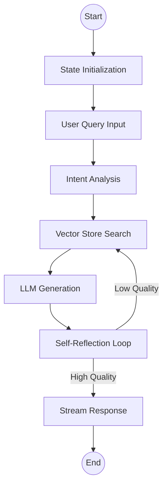

# [Analysis] Philo-RAG 고도화: LangGraph 및 RAGAS 도입

## 1. 개요 (Description)
현재의 단발성 Q&A 구조를 개선하여, 대화의 맥락(State)을 유지하고 답변의 품질을 정량적으로 평가할 수 있는 지능형 RAG 시스템으로 고도화합니다.

## 2. 사용자 스토리 (User Stories)

### US-001: 멀티턴 대화 상태 관리 (LangGraph)
- **As a** 사용자
- **I want to** 내가 이전에 했던 질문의 논리적 흐름을 유지하며 심화된 철학적 대화를 나누고 싶다.
- **Acceptance Criteria:**
  - 사용자의 질문을 분석하여 현재 대화 상태(State)에 저장한다.
  - 대화의 흐름이 끊기지 않도록 이전 답변과 연계된 컨텍스트를 LLM에 전달한다.
  - 대화가 주제에서 벗어날 경우 이를 감지하고 원래 주제로 유도한다.

### US-002: 답변 품질 자동 평가 (RAGAS)
- **As a** 개발자
- **I want to** AI의 답변이 얼마나 정확하고(Faithfulness) 관련성이 높은지(Relevance) 수치로 확인하고 싶다.
- **Acceptance Criteria:**
  - 답변 생성 후 RAGAS를 통해 Faithfulness, Answer Relevance 점수를 계산한다.
  - **Faithfulness 0.7 미만 또는 Answer Relevance 0.7 미만**의 답변이 생성될 경우 로그를 기록하고, 최대 2회까지 재검색 및 재생성을 시도하는 개선 프로세스를 실행한다.
  - 평가 결과를 대시보드나 로그 파일로 확인할 수 있다.

## 3. 아키텍처 설계 (Architecture Notes)

### LangGraph Workflow

### RAGAS Integration
- **Metrics:** Faithfulness, Answer Relevance, Context Precision.
- **Trigger:** 응답 완료 후 비동기적으로 평가 로직 실행.

## 4. 보안 고려사항 (Security)

### 프롬프트 인젝션 방지 (Anti-Injection)
- 시스템 프롬프트에 `Strict Instruction` 반영 (기초 단계 구현됨: `llm.py: get_rag_prompt`).
- **미구현/추후 반영 예정:** 입력 데이터 검증(Sanitization) 및 `Post-Prompting` 기법을 사용한 핵심 지침 재강조 로직.

---
## 5. 향후 개선 사항 (Future Improvements / TODO)
- [ ] **한국어 최적화 평가 모델 도입**: RAGAS 평가 시 `text-embedding-3-small` 또는 다국어 지원 모델을 사용하여 한국어 답변의 Relevancy 측정 정확도 향상.
- [ ] **보안 2/3차 방어선 구축**: Intent Routing 및 Similarity Threshold 적용을 통한 강력한 도메인 보호.
- [ ] **평가 결과 시각화 대시보드 구축**: `eval_logs` 데이터를 프론트엔드에서 한눈에 확인할 수 있는 대시보드 페이지 구현.

---
> [!NOTE]
> 이 스토리는 `BMAD-METHOD` 가이드라인에 따라 작성되었습니다.
